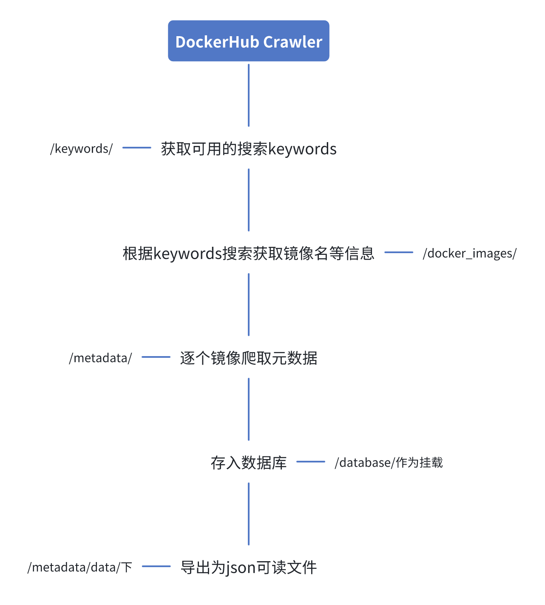

# metadata_crawler_docker
To deploy the crawler with docker image.
The Original Repo refers https://github.com/DockerHub-analysis-framework/metadata-crawler

**操作系统和依赖**
- Ubuntu 22.04.3 LTS x86_64
- Python 3.10.12

## 主要流程

1. 爬取可用的关键词
2. 用关键词获取完整的镜像名
3. 用镜像名查询API获取镜像的详细信息